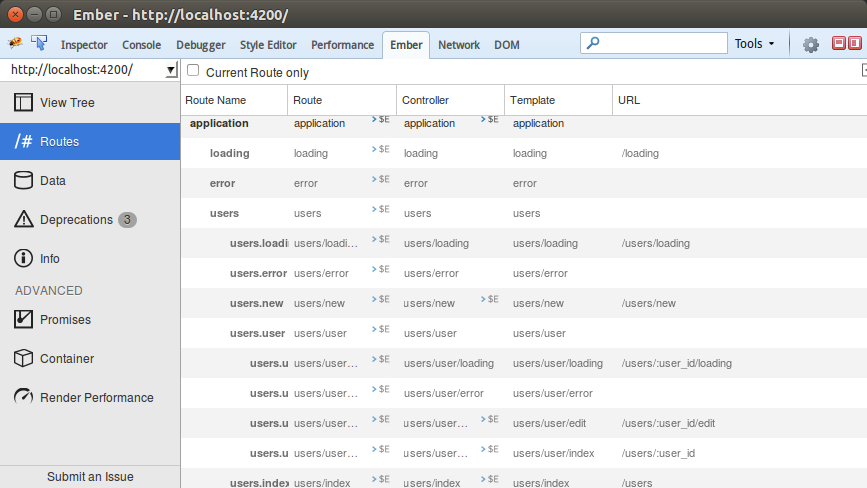

# ember-cli 的安装

首先要说明的就是ember-cli的安装。如果你已经安装了nodejs和npm，则可以越过前面的小节，否则首先要安装nodejs。注意ember-cli需要的nodejs版本是**0.12**以上。

## nodejs

[nodejs](http://nodejs.org) 大家肯定都不会陌生，他和java、php一样是服务器端语言。nodejs的语法是js，是的，现在js也可以在服务器端运行。前端js和后端js一个区别就是nodejs可以操作文件，所以我们上一节提到的工具Grunt、Gulp或者ember-cli都依赖他。首先我们要安装nodejs和npm（npm是node的包管理器）。

### nodejs with windows
安装方法很简单，直接在网站上下载安装包就可以了。nodejs首页就可以看到，下载下来之后根据提示安装就可以安装成功。

然后打开cmd运行

```sh
node -v
npm -v
```

如果能正确打印出版本号，说明nodejs正确安装了;如果提示没有node命令，那可能是没有找到node路径，那么需要在系统环境变量PATH里面添加一条node路径。

在命令行里输入：

```sh
# 比如nodejs安装在了D盘
SET PATH=D:\Nodejs;%PATH%
```

或者右键计算机 -> 属性 -> 高级系统设置 -> 高级 -> 环境变量 -> 系统变量 -> 找到PATH后双击，把nodejs的安装路径复制进去：


### nodejs with linux
linux上的安装方法也很简单，拿Ubuntu为例，直接在包管理器里面就可以找到nodejs并下载，不过要记得加sudo：

```sh
sudo apt-get install nodejs
```

但是要注意一点，ember-cli要求node的本版号是**0.12**，而从apt-get里面安装的版本号是**0.10**，所以只能从官网下载0.12版本。

如果下载的是源码文件那么需要按照官方文档去编译。不过Ubuntu已经自带了编译node的工具，解压之后直接编译就可以了。

```sh
./configure
make
sudo make install
```

执行完之后看一下node的版本号：

```sh
node -v
```

打印出：

```sh
v0.12.4
```

表示安装成功。

## ember-cli、bower、PhantomJS

安装ember-cli需要用到npm。要加`-g`参数把ember-cli安装在全局，这样才可以在命令行使用ember命令。使用下面的命令安装：

```sh
# windows
npm install -g ember-cli

# linux
sudo npm install -g ember-cli
```

安装时间有点长，可能需要10-20分钟。如果没有报任何错误，说明安装完成。安装完成之后会打印出依赖树。之后使用ember命令来查看安装是否成功：

```sh
ember v
```

如果打印出下面的内容说明安装成功：

```sh
version: 0.2.7
Could not find watchman, falling back to NodeWatcher for file system events.
node: 0.12.4
npm: 2.11.0
```

[bower](bower.io)是一个前端依赖管理器，我们常用到的需要包都可以在bower里面找到，如jQuery。当然ember也在里面。安装bower也是用npm去全局安装：

```sh
npm install -g bower
```

安装成功之后通过bower命令查看：

```sh
bower -v
```

bower当前的版本号。

[PhantomJS](phantomjs.org)是一个浏览器，这么说应该不过分。他没有界面让我们看，只是跑代码，所以用来测试非常合适。ember-cli默认是使用phantomjs来进行测试。安装的方法也是通过npm安装：

```sh
npm install -g phantomjs
```

然而可以把这些命令合并起来一并安装：

```sh
npm install -g ember-cli bower phantomjs
```

这样我们需要的工具就全部安装完成。

## ember-inspector

[ember-inspector](https://github.com/emberjs/ember-inspector)对于ember开发者而言是一个非常有用的工具。他是一个浏览器插件，用来调试ember的各种东东，包括视图树，路由，数据等等等，并且可以查看渲染性能：



他可以在ff和ch安装。chrome直接在商店搜就可以了，或者点击这个[Chrome Stroe](https://chrome.google.com/webstore/detail/ember-inspector/bmdblncegkenkacieihfhpjfppoconhi)；firefox的话附加组件里面搜不到，要点击这里安装[firefox addon](https://addons.mozilla.org/en-US/firefox/addon/ember-inspector/)。

## watchman

用过Grunt或是Gulp的同学一定对watch不会陌生，他用来监视文件改变。同样，[watchman](https://facebook.github.io/watchman)也是做这个的，从名字就可以看出，而ember-cli默认使用的就是watchman。如果没有安装他，ember-cli会告诉你没有使用watchman而使用node watch代替:

```sh
Could not find watchman, falling back to NodeWatcher for file system events
```

很可惜的是watchman不支持在win上运行。安装方法很简单，在官方下载[watchman源码](https://github.com/facebook/watchman.git)解压安装就可以了。不过安装他要有autoconf和automake，这两个东东可以通过apt-get去安装：

```sh
sudo apt-get install autoconf
```

安装autoconf时会自动安装automake。安装完成后就可以通过下面的命令去安装watchman了：

```sh
./autogen.sh
./configure
make
sudo make install
```

一步步来就可以安装成功。安装时有一些选项可以附加，比如安装路径一类，查阅官方文档就好了。

## X宝 npm 源

对于吾国的超级防火墙，那是服的不行，google、youtube、twitter、facebook什么的在国内打不开，只能翻墙走代理。这样就有了一个问题，如果npm上的包挂在google的服务器组，那肯定下载不来。为了解决这个问题，X宝出了[npm镜像](npm.taobao.org)，我们访问这个镜像就可以很轻松的下载。

使用方法有很多，这里就简单介绍一种，只需要在npm后面加参数改变源就可以了：

```sh
npm --registry=https://registry.npm.taobao.org
```

加好这些参数后npm的用法还是和以前一样，只不过会去请求X宝的源。不过ember-cli可以通过npm直接下载下来，已经过验证。

## X宝 gem 源

npm还好，gem就惨了，直接被墙掉了，使用gem安装sass肯定是下载不来。好在X宝也有gem源。gem源需要替换，方法如下：

```sh
gem sources --remove https://rubygems.org/
gem sources -a https://ruby.taobao.org/
```

这样我们就可以从X宝的源安装了：

```sh
gem instal sass
```

## Summary

所需要的工具安装好之后就可以开心的开始coding啦，慢着，我们还需要一个好用的编辑器。

[下一节 ember-cli 与编辑器](https://github.com/yuffiy/book/tree/master/02_ember-cli_editor/README.md)
