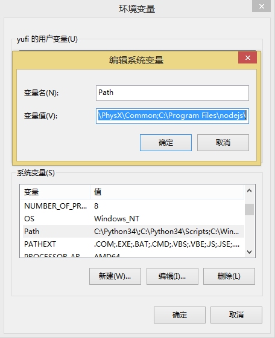

# ember-cli 的安装

恩，首先肯定是要说明ember-cli要如何安装。如果你在PC上已经装了nodejs和npm，那可以越过前面的小节，如果没有，那么首先要安装nodejs。

## nodejs

[nodejs](http://nodejs.org) 这个东东大家肯定都不会陌生，他和java、php一样是服务器端的语言，只不过他的语法是js，没错，js也是可以在后端跑的。前端js和后端js一个区别就是nodejs可以操作文件，所以我们之前提到的工具Grunt、Gulp或是ember-cli都要依赖他。那么首先我们就需要安装nodejs和npm（npm是node的包管理器）。

### nodejs with windows
安装很简单，windows平台直接在网站上下载安装包就可以了，首页一进去就是，下载下来之后下一步下一步下一步就会安装成功。

然后打开cmd运行

```sh
node -v
npm -v
```

如果能正确打印出版本号，说明nodejs正确安装;如果提示没有node命令，那可能是没有找到node路径，那么需要在系统环境变量PATH里面添加一条node路径。

在命令行里输入：

```sh
# 比如nodejs安装在了D盘
SET PATH=D:\Nodejs;%PATH%
```

或者右键计算机 -> 属性 -> 高级系统设置 -> 高级 -> 环境变量 -> 系统变量 -> 找到PATH后双击，把nodejs的安装路径复制进去：



### nodejs with linux
在linux的安装也很简单，拿Ubuntu为例，直接在包管理器里面就可以找到nodejs并下载，不过要记得加sudo：

```sh
sudo apt-get install nodejs
```

但是要注意一点，ember-cli要求node的本版号是**0.12**，而从apt-get里面安装的版本号是0.10，无语…，…只能从官网上下载0.12版本。

如果下载的是源码文件那么需要按照官方文档去编译，需要注意的是Ubuntu已经自带了编译node的一些工具，解压后直接编译就可以了。

```sh
./configure
make
sudo make install
```

执行完之后看一下node的版本号：

```sh
node -v
```

打印出

```sh
v0.12.4
```

表示安装成功。

## ember-cli、bower、PhantomJS

注意：没看上面的同学要注意的是，ember-cli需要的nodejs版本是0.12.X以上，如果你的nodejs版本不是0.12，那就赶紧先去下载最新版本吧。

安装ember-cli需要用到npm。我们把ember-cli安装在全局，只有这样才能够在命令行简单的使用ember命令。使用下面的命令安装：

```sh
# windows
npm install -g ember-cli

# linux
sudo npm install -g ember-cli
```

安装时间有点长，可能需要10-20分钟。如果没有报任何错误，说明安装完成。安装完成之后会打印出依赖树。现在我们就可以使用ember命令来查看安装是否成功：

```sh
ember v
```

如果打印出下面的东东说明安装成功：

```sh
version: 0.2.7
Could not find watchman, falling back to NodeWatcher for file system events.
node: 0.12.4
npm: 2.11.0
```

[bower](bower.io)是一个前端依赖管理器，我们常用到的需要包都可以在bower里面找到，比如jQuery。当然ember也在里面。安装bower也是用npm去全局安装：

```sh
npm install -g bower
```

安装成功之后通过bower命令查看：

```sh
bower -v
```

这样会看到bower的当前版本号。

[PhantomJS](phantomjs.org)是一个浏览器，这么说应该不过分。他没有界面让我们看，只是跑代码，所以这个东东用来测试非常合适，ember-cli默认是使用他来进行测试的。安装的方法也是通过npm安装：

```sh
npm install -g phantomjs
```

当然我们可以把这些命令合起来一并安装：

```sh
npm install -g ember-cli bower phantomjs
```

这样我们需要的工具就全部安装完成。

## 淘宝 npm 源

对于我们的超级防火墙，那是牛的不行。google、youtube、twitter、facebook什么的在国内打不开，只能翻墙走VPN。这样就有了一个问题，如果npm上的代码一部分挂在google的服务器组，那肯定是下载不下来的。为了解决这个问题，X宝出了[npm镜像](npm.taobao.org)，我们访问这个镜像就可以很轻松的下载。

使用方法有很多，这里就简单介绍一种，只需要在npm后面加参数改变源就可以了：

```sh
npm --registry=https://registry.npm.taobao.org --cache=$HOME/.npm/.cache/cnpm --disturl=https://npm.taobao.org/dist --userconfig=$HOME/.cnpmrc
```

加好这些参数后npm的用法还是和以前一样，只不过会去请求X宝的源。不过ember-cli可以通过npm直接下载下来，已经过验证。

## 淘宝 gem 源

npm还好，gem就惨了，直接被墙掉了，使用gem安装sass肯定是下载不来的。好在X宝也有gem源。gem源需要替换：

```sh
gem sources --remove https://rubygems.org/
gem sources -a https://ruby.taobao.org/
```

这样我们就可以从X宝的源安装了：

```sh
gem instal sass
```

## summary

所需要的工具安装好之后就可以开心的开始coding啦，慢着，我们还需要一个好用的编辑器。

[下一节 ember-cli 与编辑器](https://github.com/yuffiy/book/tree/master/02_ember-cli_editor)
