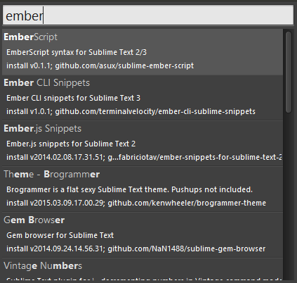
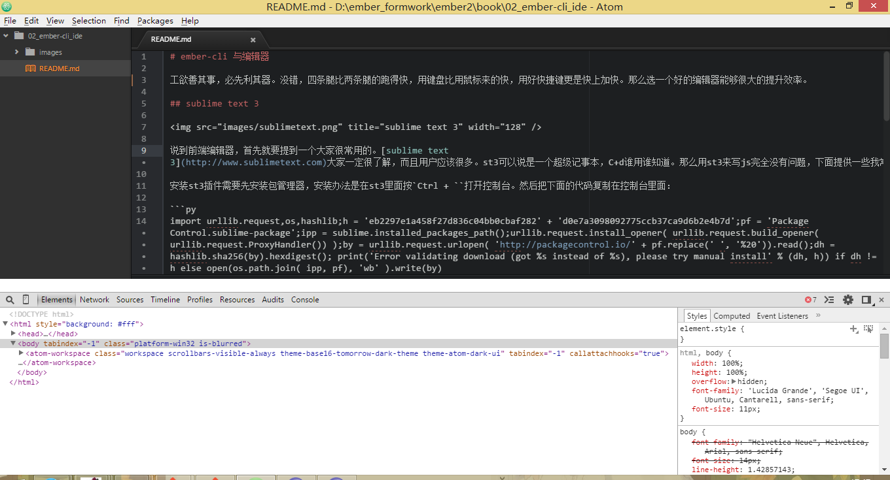
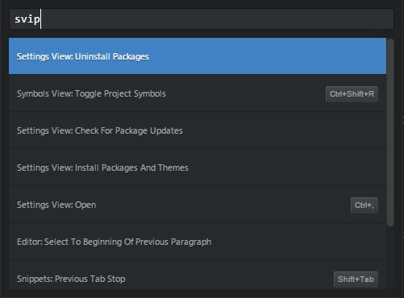
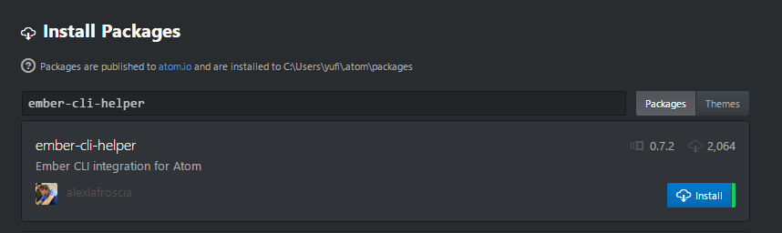
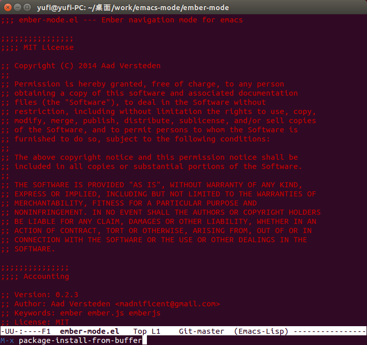
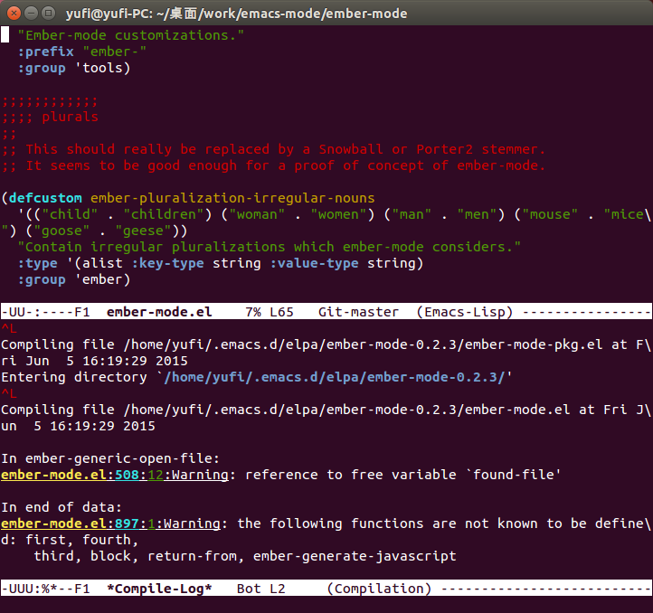
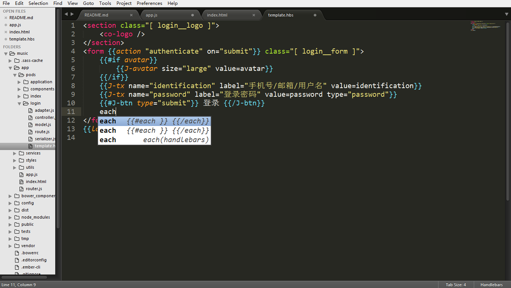
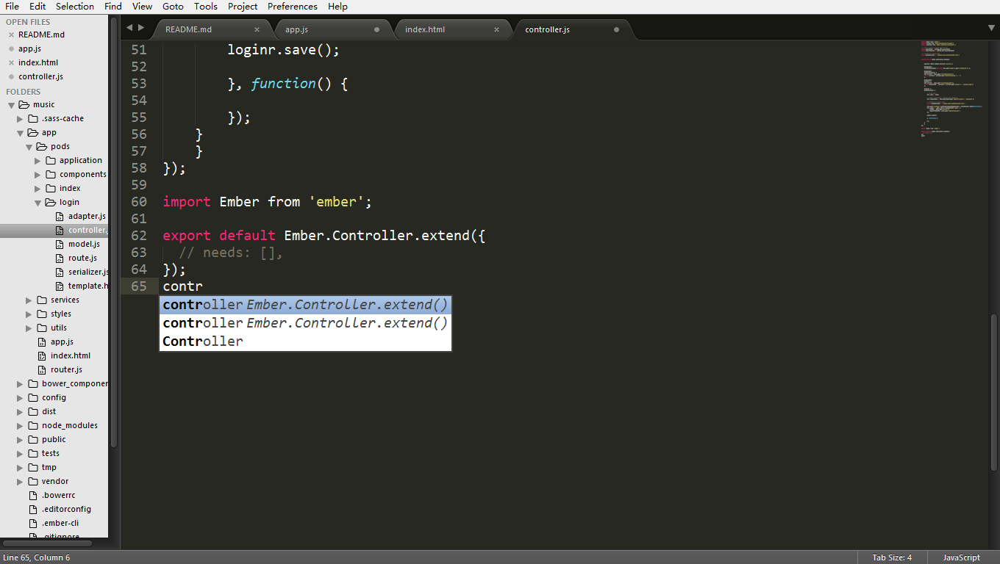
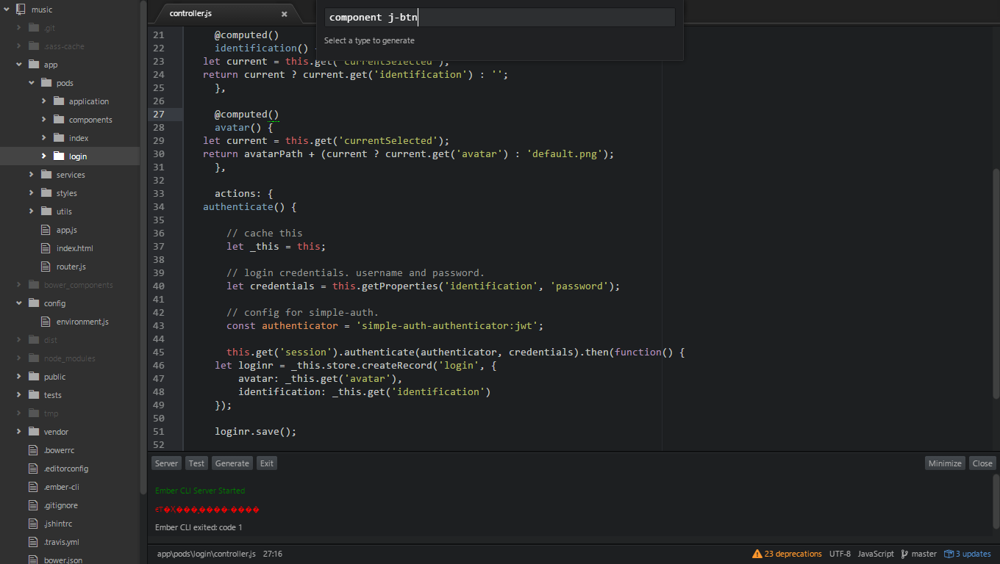
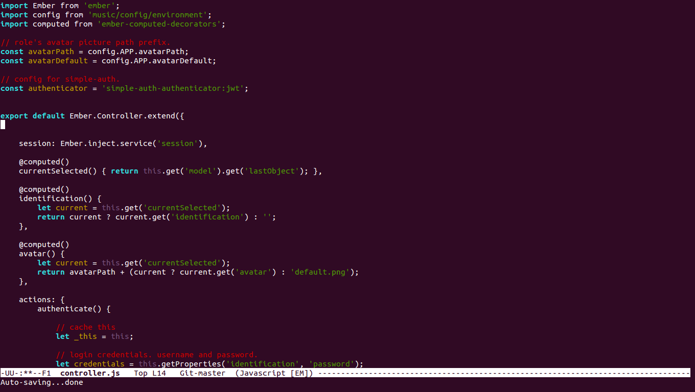

# ember-cli 与编辑器

工欲善其事，必先利其器。用好一个好的编辑器能够很大的提升效率。所以在这章给大家推荐一些我喜欢的编辑器。

## sublime text 3


说到前端编辑器，首先要提到一个大家很常用的，那就是[sublime text 3](http://www.sublimetext.com)，大名鼎鼎的st3的用户很多。st3可以说是一个超级记事本，`Ctrl + D`谁用谁知道。用st3来写ember代码完全没有问题。

st3一个强大的原因就是在于他的插件，他的插件很丰富，基本常用的都可以找到。除了插件之外还可以有一些小型模板（snippet）来帮助我们快速开发。安装st3插件需要先安装包管理器，安装办法是在st3里面按`Ctrl + ``打开控制台。然后把下面的代码复制在控制台里面：

```py
import urllib.request,os,hashlib;h = 'eb2297e1a458f27d836c04bb0cbaf282' + 'd0e7a3098092775ccb37ca9d6b2e4b7d';pf = 'Package Control.sublime-package';ipp = sublime.installed_packages_path();urllib.request.install_opener( urllib.request.build_opener( urllib.request.ProxyHandler()) );by = urllib.request.urlopen( 'http://packagecontrol.io/' + pf.replace(' ', '%20')).read();dh = hashlib.sha256(by).hexdigest(); print('Error validating download (got %s instead of %s), please try manual install' % (dh, h)) if dh != h else open(os.path.join( ipp, pf), 'wb' ).write(by) 
```

回车确定后重启，这样就可以使用[Package Control](https://packagecontrol.io/installation)了。使用快捷键`Ctrl + Shift + P`打开st3的命令行输入`cpi`(Control Package Install)，然后输入名称来查找我们常用的插件如sass、less、coffee等。



下面ember的一些常用插件，使用这些插件在输入的时候会有自动补全：

* [Handlebars Snippets](https://packagecontrol.io/packages/Handlebars)
* [Ember.​js Snippets](https://packagecontrol.io/packages/Ember.js%20Snippets)
* [Ember CLI Snippets](https://packagecontrol.io/packages/Ember%20CLI%20Snippets)
* [sublime资源](https://github.com/JaredCubilla/sublime)

在使用st3和ember-cli的时候还需要注意一点。由于ember-cli使用Broccoli，而Broccoli在编译时会在tmp文件夹生成大量的临时文件，这会变的很慢，CPU会跑到90%。最好的办法就是让st3不要监视tmp文件夹的变化，所以需要在用户设置 Preferences -> Settings -> User里面加入这样一句话:

```js
// folder_exclude_patterns and file_exclude_patterns control which files
// are listed in folders on the side bar. These can also be set on a per-
// project basis.
"folder_exclude_patterns": [".svn", ".git", ".hg", "CVS", "tmp/class-*", "tmp/es_*", "tmp/jshinter*", "tmp/replace_*", "tmp/static_compiler*", "tmp/template_compiler*", "tmp/tree_merger*", "tmp/coffee_script*", "tmp/concat-tmp*", "tmp/export_tree*", "tmp/sass_compiler*"]
```

这样在编译过程中就不会看到左侧项目树tmp文件夹中文件的变化。

## Atom


[Atom](https://atom.io/)是我最喜欢的编辑器（但不是日常用的），为什么这么说呢？首先他是用nodejs构建的，而且可以自由定制。我们可以在atom里打开控制台像这个样子：



是不是很熟悉，相信你一定在chrome里见过这个面板。atom的界面就是html构成的，谁让是v8呢。所以说，可以自己写样式表来构建桌面，可以写js来定制行为。不过atom使用less和coffee编译源码。

atom是由github团队开发的，使用git可以很方便的提交文件到github。并且可以直接跳到github上查看，这也是我喜欢喜欢atom的原因。

atom有自己的包管理器，叫做apm。我们可以通过命令行和界面两种方式来安装插件，下面以安装ember-cli-helper为例：

### 通过命令行来安装插件

安装方法和npm安装依赖是一样的。

```js
apm install ember-cli-helper
```

### 使用Atom GUI安装插件

操作方法和st3类似，首先按下快捷键`Ctrl + Shift + P`，然后输入`svip`，找到并点击`Setting View: Install Packages and Themes`：



然后进入到Install Packages的页面，里面有搜索，输入ember-cli-helper，点击蓝色的安装按钮就可以了。



其他的插件也是通过这种方法添加，方便简单。

## Emacs


对于这个编辑器应该说点好什么呢。emacs是我日常coding的编辑器。这个编辑器挺魔性的，用习惯后根本停不下来，其他编辑器基本都废了。然而在用过HHKB之后更是这样，说到这里很有必要晒一下我的HHKB(请原谅我)：


emacs的按键实在太好用了，并且可以随意定制。

虽然emacs使用的人不多，但是也有必要提一下，原因是他有一个[ember-mode](https://github.com/madnificent/ember-mode)，这个主模式提供了一组快捷键，使用`C-c`加各种组合就可以快速的使用ember-cli的各种功能，很强大。安装方法很多，最简单的一种就是把源码下载下来，打开后`M-x package-install-from-buffer`。不过这里要注意一个地方，源码有一处错误会导致安装不成功，Version那里需要加一个`:`号，PR已经提交。





## summary

当然还有一些其他编辑器也非常优秀，如[WebStorm](https://www.jetbrains.com/webstorm/)，这里介绍这三个的原因是因为他们的一些插件可以帮助我们提高开发效率，下面是一些使用这些插件的截图：









选择一个好的工具固然重要，倒也不是必须的，毕竟大家使用记事本不靠自动补全也是完全没有问题的嘛。下一节我们来数据ember-cli工具的使用。

[上一节 ember-cli 安装](https://github.com/yuffiy/book/tree/master/01_ember-cli-install/README.md)
[下一节 ember-cli 快速熟悉](https://github.com/yuffiy/book/tree/03_ember-cli_start/README.md)
