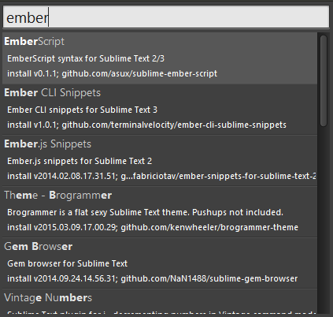
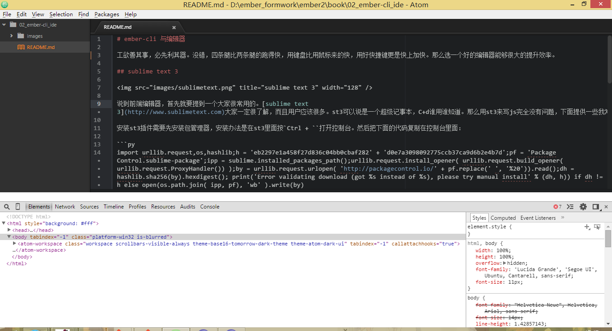
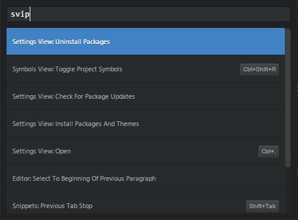
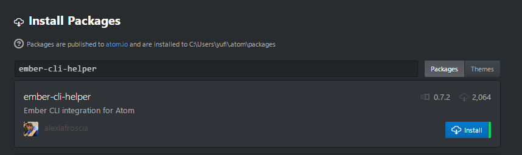

# ember-cli 与编辑器

工欲善其事，必先利其器。没错，四条腿比两条腿的跑得快，用键盘比用鼠标来的快，用好快捷键更是快上加快。那么选一个好的编辑器能够很大的提升效率。

## sublime text 3


说到前端编辑器，首先就要提到一个大家很常用的。[sublime text 3](http://www.sublimetext.com)大家一定很了解，而且用户应该很多。st3可以说是一个超级记事本，`Ctrl + D`谁用谁知道。用st3来写ember-cli完全没有问题。

安装st3插件需要先安装包管理器，安装办法是在st3里面按`Ctrl + ``打开控制台。然后把下面的代码复制在控制台里面：

```py
import urllib.request,os,hashlib;h = 'eb2297e1a458f27d836c04bb0cbaf282' + 'd0e7a3098092775ccb37ca9d6b2e4b7d';pf = 'Package Control.sublime-package';ipp = sublime.installed_packages_path();urllib.request.install_opener( urllib.request.build_opener( urllib.request.ProxyHandler()) );by = urllib.request.urlopen( 'http://packagecontrol.io/' + pf.replace(' ', '%20')).read();dh = hashlib.sha256(by).hexdigest(); print('Error validating download (got %s instead of %s), please try manual install' % (dh, h)) if dh != h else open(os.path.join( ipp, pf), 'wb' ).write(by) 
```

回车确定后重启st3，这样就可以使用[Package Control](https://packagecontrol.io/installation)了。使用快捷键`Ctrl + Shift + P`打开st3的命令行输入`cpi`(Control Package Install)，然后输入名称来查找我们常用的插件比如sass、less、coffee。



对于ember来说有一些常用的插件，这样我们在输入的时候就会有自动补全：

* [Handlebars Snippets](https://packagecontrol.io/packages/Handlebars)
* [Ember.​js Snippets](https://packagecontrol.io/packages/Ember.js%20Snippets)
* [Ember CLI Snippets](https://packagecontrol.io/packages/Ember%20CLI%20Snippets)
* [sublime资源](https://github.com/JaredCubilla/sublime)

在使用st3和ember-cli的时候还需要注意一个地方。由于ember-cli使用Broccoli，而Broccoli会在tmp生成大量的文件夹和文件，这会变得很慢，CPU会跑到90%。最好的办法就是让st3不要监视tmp文件夹的变化，所以需要在用户设置 Preferences -> Settings -> User里面加入这样一句话:

```js
// folder_exclude_patterns and file_exclude_patterns control which files
// are listed in folders on the side bar. These can also be set on a per-
// project basis.
"folder_exclude_patterns": [".svn", ".git", ".hg", "CVS", "tmp/class-*", "tmp/es_*", "tmp/jshinter*", "tmp/replace_*", "tmp/static_compiler*", "tmp/template_compiler*", "tmp/tree_merger*", "tmp/coffee_script*", "tmp/concat-tmp*", "tmp/export_tree*", "tmp/sass_compiler*"]
```

这样在编译过程中就不会看到左侧项目树tmp文件夹中文件的变化。

## Atom


[Atom](https://atom.io/)是我最喜欢的编辑器（但不是日常用的），为什么这么说呢？首先他是用nodejs构建的，而且可以自由定制。我们可以在atom里打开控制台像这个样子：



是不是很熟悉，相信你一定在chrome里见过这个面板，atom的界面就是html构成的，谁让是v8呢。所以说，你可以自己写样式表来构建桌面，可以写js来定制行为，不过atom使用的是less和coffee，从源码文件就可以看的到。

atom是由github团队开发的，使用git和github可以很方便的提交文件，并且从右键菜单就可以跳到github上查看。这也是我喜欢喜欢atom的原因之一。

atom有自己的包管理器，叫做apm。我们可以通过两种方式来安装插件，下面以安装ember-cli-helper为例：

### 通过命令行来安装插件

安装方法和npm安装依赖是一样的。

```js
apm install ember-cli-helper
```

### 使用Atom GUI安装插件

操作方法和st3类似，首先按下快捷键`Ctrl + Shift + P`，然后输入`svip`，找到并点击`Setting View: Install Packages and Themes`：



然后进入到Install Packages的页面，里面有搜索，输入ember-cli-helper，点击蓝色的安装按钮就可以了。



其他的插件也是通过这种方法添加，方便简单。

## Emacs


