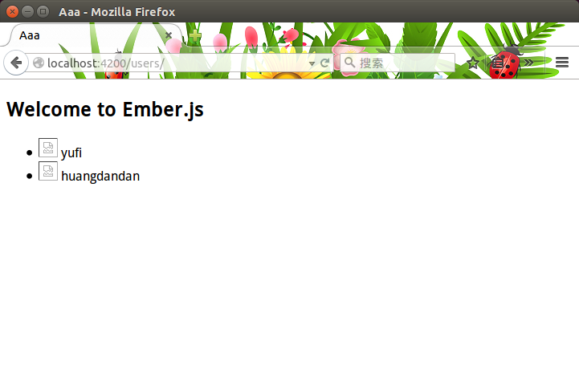
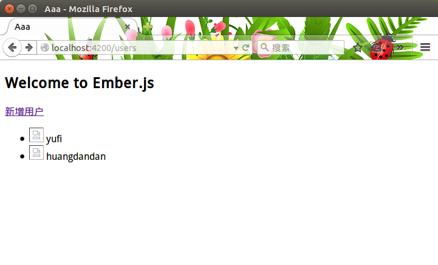
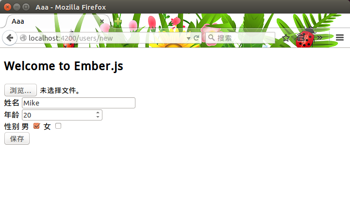
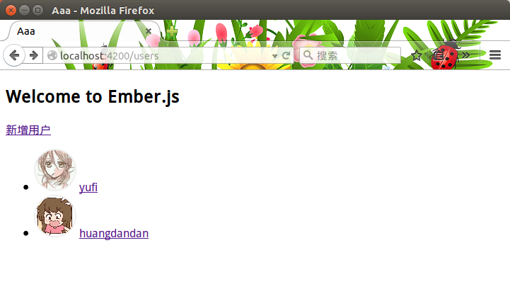
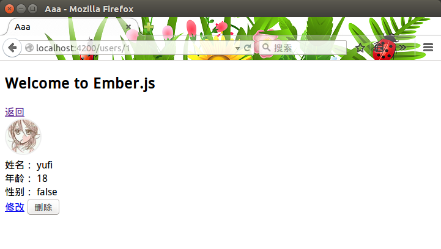
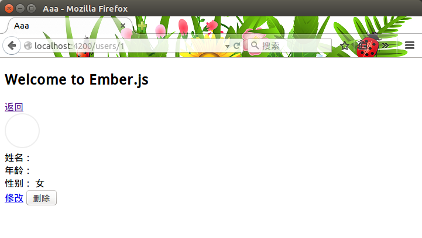
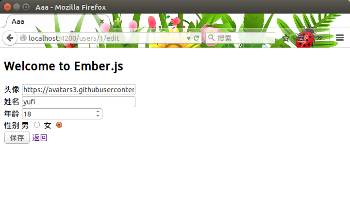

# ember-cli 快速开发

ember-cli中有一个叫做**generate**的命令，用好他能大大提高打怪效率。这节我们主要来介绍他。

## 准备工作

在开始之前让我们来稍微设计一下。

demo是一个简单的用户增删改查，他包括一个列表用来显示用户的头像和姓名，一个页面用来显示用户的详细信息并且有修改和删除功能，一个表单用来添加和修改用户。

按照ember-data的规则，一群用户应该使用user的复数，也就是users。如果是person要注意复数是people而不是persons，挑战英文水平的时刻到了。我们的路由根据上面的说明简单设计为：

| 动作             | 路径            | 名称  | 作用     |
| :----------------| :---------------| :----:| :-------:|
| 初始加载         | /users/index    | index | 所有用户 |
| 点击新增用户按钮 | /users/new      | new   | 新增用户 |
| 点击列表中的某只 | /users/:id      | user  | 用户详情 |
| 点击详细修改按钮 | /users/:id/edit | edit  | 修改用户 |

这就是我们的路径规则，先不着急修改router.js。

## 增删改查

接下来设计一下用户模型，很简单，这里只需要姓名name、性别sex和年龄age和头像avatar四个字段。

我们用ember generate来创建模板，在命令行输入下面命令：

```sh
ember g model user
```

完成后我们看到ember-cli生成了两个文件，一个是user.js，他放在`app/models`里，一个是测试文件，放在tests/unit/models下面。打开`app/models/user.js`定义模型：

```js
// app/models/user.js

import DS from 'ember-data';

let attr = DS.attr;

export default DS.Model.extend({

  avatar: attr('string'),
  name: attr('string'),
  age: attr('number'),
  sex: attr('boolean') // true: male, false: famale
  
});
```

## 用户列表

接下来先来实现用户列表，为此首先准备一组假数据：

```js
[{
  avatar: 'https://avatars3.githubusercontent.com/u/5752902',
  name: 'yufi',
  age: 18,
  sex: false
},{
  avatar: 'https://avatars3.githubusercontent.com/u/9463495',
  name: 'huangdandan',
  age: 18,
  sex: false
}]
```

还是使用generate来生成路由：

```sh
ember g router users/index
```

这次看到生成了三个文件，除了路由，还生成了模板。这就是ember-cli贴心的地方，他知道你一定会去修改模板，所以提前为你生成。当然贴心的还不止这些，是时候解释刚才不着急修改router.js的原因了。打开router.js我们可以看到使用generate后ember-cli会自动修改路由。然而这里要注意默认路由的问题，因为我们刚才使用的是**users/index**，所以不会自动为你创建index路由，原因是ember**约定**index的路径就是**/**。但是会创建index文件。

如果这里已经提前建好了模板，ember-cli会询问你是否需要重写，根据需要输入y或者n就可以了。

将假数据写在`app/routes/users/index.js`的model钩子里：

```js
// app/routes/user/index.js

import Ember from 'ember';

export default Ember.Route.extend({

  model() {
    return [{
      avatar: 'https://avatars3.githubusercontent.com/u/5752902',
      name: 'yufi',
      age: 18,
	  sex: false
	},{
	  avatar: 'https://avatars3.githubusercontent.com/u/9463495',
	  name: 'huangdandan',
	  age: 18,
	  sex: false
	}];
  }
});

```

接下来给列表模板`app/templates/users/index.hbs`添加内容：

```hbs
<ul>
  {{#each model as |user|}}
  <li>
    <div>
	  <span class="avatar"></span>
	  <span>{{user.name}}</span>
    </div>
  </li>
  {{/each}}
</ul>
```

完成之后看下浏览器里的变化，好像什么都没有，哪里错了么？

我们知道访问根目录`/`实际访问的路由是**index**，而然现在还没有index模板。访问`/users`则会看到刚才的列表：



解决办法想到了三个：

1. 在index路由里添加逻辑，在beforeModel钩子里跳转到`/user`;
2. 在index模板里放一个链接按钮;
3. 在router.js里面修改users的path路径成`/`

任性的选择第一种。新建index路由：

```sh
ember g route index
```

将跳转逻辑写在beforeModel钩子里：

```js
// app/routes/index.js

import Ember from 'ember';

export default Ember.Route.extend({

  beforeModel() {
    this.transitionTo('users');
  }
});
```

页面自动刷新后看到自动跳到了`/users`，重新输入`http://localhost:4200`也会跳转。

不过，貌似头像太大了，写样式简单控制一下，打开`app/styles/app.css`：

```css
.avatar {
  display: inline-block;

  width: 56px; height: 56px;
  border-radius: 50%;

  border: 2px solid #eee;

  overflow: hidden;
}

.avatar img {
  width: 100%; height: auto;
}
```

## 新增用户

很好，接下来实现用户新增。修改列表模板来增加一个新增用户按钮。因为这个按钮只有跳转到`users/new`这一个功能，所以用`link-to`就可以了：

```hbs
{{!-- app/templates/users/index --}}

{{!-- 在开头添加 --}}
{{#link-to 'user.new'}}新增用户{{/link-to}}
```

创建一个新增用户的路由：

```sh
ember g route users/new
```

修改新增用户模板`app/templates/users/new.hbs`：

```hbs
<form {{action 'doSave' on='submit'}}>
  <div>
    <label for="avatar">头像</label>
    {{input name="avatar" id="avatar" value=avatar}}
  </div>
  <div>
    <label for="name">姓名</label>
	{{input name="name" id="name" value=name}}
  </div>
  <div>
    <label for="age">年龄</label>
	{{input name="age" id="age" type="number" value=age}}
  </div>
  <div>
    <label for="sexM">性别</label>
	<label for="sexM">男</label>
	<input name="sex" id="sexM" type="radio" checked={{sex}} {{action "toggleSex" on="change"}} />
	<label for="sexF">女</label>
	<input name="sex" id="sexM" type="radio" checked={{sexInverseValue}} {{action "toggleSex" on="change"}} />
  </div>
  <div>
    <button type="submit">保存</button>
	{{#link-to 'users'}}返回{{/link-to}}
  </div>
</form>
```

创建好后会自动刷新页面，点击新增用户。浏览器跳转到了`/users/new`，并且看到刚刚创建的表单。

接下来实现`doSave`逻辑，这时我们需要一个控制器：

```sh
ember g controller users/new
```

打开app/controllers/users/new.js，提取数据并且保存：

```javascript
import Ember from 'ember';

export default Ember.Controller.extend({
  age: "18",
  sex: true,
  sexInverseValue: Ember.computed('sex', function() {
    return !this.get('sex');
  }),
  actions: {
    toggleSex() {
	  this.toggleProperty('sex');
	  return false;
	},
    doSave() {
      let user = this.getProperties('avatar', 'name', 'age', 'sex');
	}
  }
});
```

这个`user`要保存到哪里呢？然而列表的实体是假的，并没有什么卵用。所以接下来要做的是从服务器端提取数据：

```sh
ember g http-mock users
```

这次生成的内容有点多。多了一个`server`文件夹，里面生成了一个`index.js`，还有一个mocks文件夹，里面有需要的`users.js`。之后通过npm添加了三个依赖，分别是**morgan**、**golb**、和**express**。使用过nodejs的同学一定知道express。express是一个web框架，用来处理请求和响应。打开`users.js`可以惊奇的看到增删改查都齐了，只需要处理数据就可以了。这里就不连接数据库了，还是使用刚才的假数据。

修改`server/mocks/users.js`：

```javascript
var users = [{
    id: '1',
	avatar: 'https://avatars3.githubusercontent.com/u/5752902',
	name: 'yufi',
	age: 18,
	sex: false
  },{
    id: '2',
	avatar: 'https://avatars3.githubusercontent.com/u/9463495',
	name: 'huangdandan',
	age: 18,
	sex: false
}];

usersRouter.get('/', function(req, res) {
  res.send({
    'users': users
  });
});
```

接着修改`app/users/index`路由的model钩子，改成从服务器端请求：

```javascript
model() { return this.store.find('user'); }
```

把页面返回到`/users`看到页面报错了，请求`/users`报了404，可是刚才明明写了返回。没办法只能重启一下服务，按C-c两下关掉服务，然后再次重启。

发现还是什么都没，怎么回事呢？我们再来看一下`server/mocks/users.js`的最后一行：

```javascript
app.use('/api/users', usersRouter);
```

原来请求发错了地方，要发往`/api/users`，而不是`/users`。好像适配器可以解决这个问题。新建一个适配器：

```sh
ember g adapter application
```

在适配器/app/adapters/application.js里声明`namespace`：

```js
// app/adapters/application.js

import DS from 'ember-data';

export default DS.RESTAdapter.extend({
  namespace: 'api'
});
```

页面自动刷新后数据出来了：



绕了一个大圈子，现在是时候去实现doSave()了，修改`app/controllers/users/new.js`：

```javascript
// app/controllers/users/new.js

doSave() {

  let user = this.getProperties('avatar', 'name', 'age', 'sex');

  let record = this.store.createRecord('user', user);

  record.save();
}
```

点击保存按钮后会向服务器发送一个`POST`请求。查看`server/mocks/users.js`服务器端自动返回`201`code码，表示创建成功。

在服务器端返回实体：

```javascript
// server/mocks/users.js

usersRouter.post('/', function(req, res) {
  var len = users.length;
  user = req.body.user;
  user.id = len + 1 + '';
  users.push(user);
  res.status(201).send({ 'user': user });
});
```

这里应该说有一个BUG，控制会报错说`req.body`是`undefined`，原因是因为`POST`请求需要解析**body**，而这里的express还没有**bodyParser**中间件。通过npm安装：

```sh
npm install --save body-parser
```

然后在`/server/index.js`中添加：

```js
// server/index.js

var bodParser = require('body-parser');
app.user(bodyParser());
```

接下来在doSave()添加保存成功后跳转：

```js
// app/controllers/users/new.js

doSave() {

  // 此处省略XX字...
  record.save().then(function() {

    return this.transitionToRoute('users');

  }.bind(this));
}
```

这时我们再去执行保存，成功之后会跳回列表并且发现多了一条：




## 用户详细信息

费了一些时间完成了新增用户，接着我们来实现显示用户的详细信息。

新建修改用户的路由：

```sh
emebr g route users/user/index
```

这时需要修改一下`user`的path地址，给他增加动态段。打开`app/router.js`：

```javascript
// app/router.js

// 修改 this.route('user', function() {});
this.route('user', { path: '/:user_id' }, function() {});
```

进入修改用户的模板应该是从用户列表单击进去。首先应该给列表模板挂上链接，打开`app/templates/users/index.hbs`：

```hbs
{{!-- app/templates/users/index.hbs --}}

{{!-- 修改 <span>{{user.name}}</span> --}}
{{#link-to 'users.user' user}}{{user.name}}{{/link-to}}
```

这样列表会挂上链接，点击姓名页面跳转地址栏会改变并且附上用户id：



接下来画一个详细信息的模板，打开`app/templates/users/user/index.hbs`：

```hbs
{{!-- app/templates/users/user/index.hbs --}}

{{#link-to 'users'}}返回{{/link-to}}
{{#with model as |user|}}
<div>
  <span class="avatar">
    
  </span>
</div>
<div>
  <span>姓名：</span>
  <span>{{user.name}}</span>
</div>
<div>
  <span>年龄：</span>
  <span>{{user.age}}</span>
</div>
<div>
  <span>性别：</span>
  <span>{{user.sex}}</span>
</div>
{{/with}}
{{#link-to 'users.user.edit'}}修改{{/link-to}}
<button type="button">删除</button>
```

页面自动刷新后报错了，提示找不到`users.user.edit`，当然现在还没有创建他：

```sh
ember g route users/user/edit
```

自动刷新后正常显示出了用户的详细信息：



这时发现性别显示貌似不是我们想要的，这里我们通过一个helper来正确显示性别。新建hepler：

```sh
ember g helper sex-fmt
```

```javascript
// app/helper/sex-fmt.js

export function sexFmt(params) {
  return params[0] ? '男' : '女';
}
```

紧接着修改模板：

```hbs
{{!-- app/templates/users/user/index --}}

{{!-- 修改 <span>{{user.sex}}</span> --}}
<span>{{sex-fmt user.sex}}</span>
```

页面自动刷新，然而数据都没有了：



这是什么情况呢？看下控制台，原来直接刷新这个页面会从服务器端`/users/1`去请求数据，而从列表跳过来因为数据已经有了，不需要从服务器端再去请求。这样我们需要修改服务器端返回单个用户信息，打开`server/mocks/users.js`：

```javascript
// server/mocks/users.js

usersRouter.get('/:id', function(req, res) {
  res.send({
    'users': users.find(function(user) {
	  return user.id === req.params.id;
	})
  });
});
```

然后服务器直接报错了，原因是因为数组原型没有find方法，貌似这个方法是ES6方法，目前只在firefox里面有。那我们手动加个垫片进去：

```javascript
// server/mocks/users.js
// form MDN. https://developer.mozilla.org/zh-CN/docs/Web/JavaScript/Reference/Global_Objects/Array/find

if (!Array.prototype.find) {
  Object.defineProperty(Array.prototype, 'find', {
    enumerable: false,
	configurable: true,
	writable: true,
	value: function(predicate) {
	  if (this == null) {
	    throw new TypeError('Array.prototype.find called on null or undefined');
	  }
	  if (typeof predicate !== 'function') {
	    throw new TypeError('predicate must be a function');
	  }
	  var list = Object(this);
	  var length = list.length >>> 0;
	  var thisArg = arguments[1];
	  var value;

      for (var i = 0; i < length; i++) {
	    if (i in list) {
		  value = list[i];
		  if (predicate.call(thisArg, value, i, list)) {
		    return value;
		  }
		}
	  }
	  return undefined;
	}
  });
}
```

加入垫片之后不再报错，刷新页面可以看到请求到了正确的数据。

## 修改用户

在做修改功能之前，发现了一个问题，貌似修改和新增模板差不多，只不过修改有默认值而新增没有罢了。这么一来把新增的模板直接复制到修改模板里面去有点不妥。组件正是我们需要的：

```sh
ember g component user-detail
```

我们把`app/template/users/new.hbs`的内容复制到组件模板里面，并修改绑定的值：

```hbs
{{!-- app/templates/components/user-detail.hbs --}}

<form {{action "doSave" on="submit"}}>
  <div>
  <label for="avatar">头像</label>
    {{input name="avatar" id="avatar" value=user.avatar}}
  </div>
  <div>
    <label for="name">姓名</label>
	{{input name="name" id="name" value=user.name}}
  </div>
  <div>
    <label for="age">年龄</label>
	{{input name="age" id="age" type="number" value=user.age}}
  </div>
  <div>
    <label for="sexM">性别</label>
	<label for="sexM">男</label>
	<input name="sex" id="sexM" type="radio" checked={{user.sex}} {{action "toggleSex" on="change"}} />
    <label for="sexF">女</label>
	<input name="sex" id="sexF" type="radio" checked={{sexInverseValue}} {{action "toggleSex" on="change"}} />
  </div>
  <div>
    <button type="submit">保存</button>
	{{#link-to 'users'}}返回{{/link-to}}
  </div>
</form>
```

然后我们就可以用组件替换模板里的内容了：

```hbs
{{!-- app/templates/users/new.hbs --}}

{{user-detail submit="doSave"}}
```

把`app/controllers/users/new.js`的部分内容复制到组件里：

```javascript
// app/components/user-detail.js

import Ember from 'ember';

export default Ember.Component.extend({
  user: Ember.computed(function() {
    let user = this.get('person') || Ember.Object.create({
	  id: '',
	  avatar: '',
	  name: '',
	  age: '18',
	  sex: true
    });
    return {
	  id: user.get('id'),
	  avatar: user.get('avatar'),
	  name: user.get('name'),
	  age: user.get('age'),
	  sex: user.get('sex')
    }
  })
  sexInverseValue: Ember.computed('user.sex', function() {
    return !this.get('user.sex');
  }),
  actions: {
    toggleSex() {
	  this.toggleProperty('user.sex');
	  return false;
	},
	doSave() {
	  this.sendAction('submit', this.get('user'));
	  return false;
	}
  }
});
```

同理把控制器里多余的逻辑删掉：

```javascript
// app/controllers/users/new.js

import Ember from 'ember';

export default Ember.Controller.extend({
  actions: {
    doSave(user) {

      delete user.id;

      let record = this.store.createRecord('user', user);

      record.save().then(function() {
	    return this.transitionToRoute('users');
	  }.bind(this));
    }
  }
});
```

接着我们在修改模板也把组件放进去：

```hbs
{{!-- app/templates/users/user/edit.hbs --}}

{{#with model as |user|}}
{{user-detail submit="doSave" person=user}}
{{/with}}
```

页面刷新后点击修改可以看到用户的值都传进组件里面：



点击保存按钮，出错了，没有找到doSave()方法，因为还没有控制器：

```sh
ember g controller users/user/edit.js
```

添加保存action：

```javascript
// app/controllers/users/user/edit.js

import Ember from 'ember';

export default Ember.Controller.extend({
  actions: {
    doSave(user) {

      let { id, avatar, name, age, sex } = user;

      this.store.find('user', id)
	    .then(function(data) {
		  data.setProperties({
		    avatar: avatar,
			name: name,
			age: age,
			sex: sex
		  });
		  return data.save();
		}.bind(this))
		.then(function() {
		  return this.transitionToRoute('users');
		}.bind(this));
	}
  }
});
```

接下来修改服务器端修改逻辑：

```javascript
// server/mocks/users.js

usersRouter.put('/:id', function(req, res) {
  var person = users.find(function(user) {
    return user.id === req.params.id;
  });

  var user = req.body.user;
  person.avatar = user.avatar;
  person.name = user.name;
  person.age = user.age;
  person.sex = user.sex;

  res.send({ 'users': users });
});
```

刷新页面尝试一下修改功能，没有问题。

## 删除用户

现在还剩下最后一个功能，删除，然而是最简单的功能。

给用户详细页面的删除按钮一个action：

```hbs
{{!-- app/templates/users/user/index.hbs--}}

{{!-- 修改 <button type="button">删除</button>--}}
<button type="button" {{action 'doDelete' user.id}}>删除</button>
```

新建一个控制器：

```sh
ember g controller users/user/index
```

添加doDelete()：

```javascript
// app/controllers/users/user/index.js

import Ember from 'ember';

export default Ember.Controller.extend({
  actions: {
    doDelete(id) {
	  this.store.find('user', id)
	    .then(function(data) {
		  return data.destroyRecord();
		})
		.then(function() {
		  this.transitionToRoute('users');
		}.bind(this));
    }
  }
});
```

在服务器端删除数据：

```javascript
// server/mocks/users.js

usersRouter.delete('/:id', function(req, res) {
  var person = users.filter(function(user) {
    return user.id !== req.params.id;
  });

  users = person;

  res.status(204).end();
});
```

测试功能，删除成功。

## Summary

demo完成了，不过我知道你们一定看不下去。下一节我们用bootstrap来美化一下界面好了。

[上一节 ember-cli 快速开始](https://github.com/yuffiy/book/tree/03_ember-cli_start/README.md)