# ember-cli 添加依赖

接上回，这节我们来用[Bootstrap](http://getBootstrap.com)美化界面。

## 安装 bs3

安装bs3方法很简单，通过bower安装就可以了：

```sh
bower install bootstrap
```

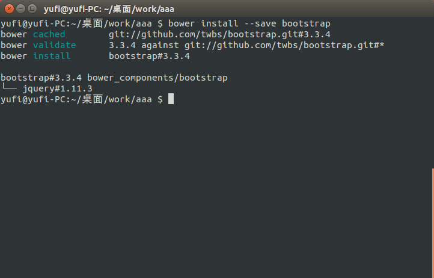

如果和图片中显示的不太一样也没有关系，因为我之前安装过bs3的原因，已经缓存下来。如果是第一次安装应该会看到下载文件的过程。

使用bower安装后会在`boser.json`挂上bootstrap的名字和所使用的版本号，文件会安装到`bower_components`文件夹中：

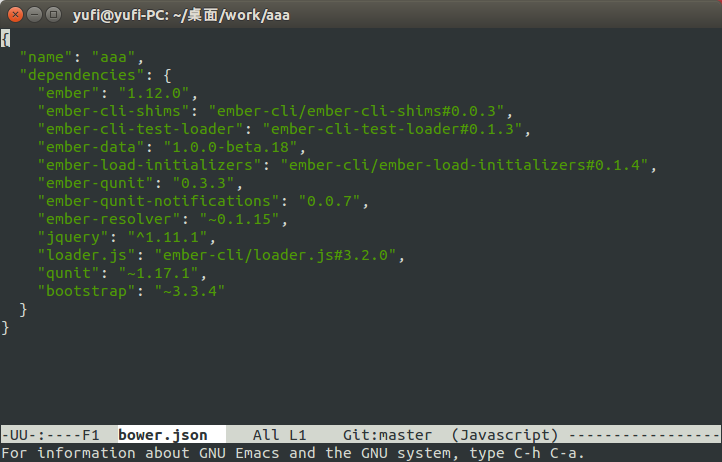

## 调教 broccoli

安装成功后需要导入项目里。具体要怎么做呢？我们知道项目是通过broccoli一路编译来的，所以需要做的就是在编译时加入bs3。打开`Brocfile.js`：

打开后发现里面有三行代码和大段注释。注释的大概意思就是使用`app.import`导入依赖并输出。现在需要bs3的css文件，在注释下面加入：

```js
app.import('bower_components/bootstrap/dist/css/bootstrap.css');
```

接着启动项目，看看broccoli编译好的文件。编译完成后打开`dist/assets/vendor.css`，可以看到broccoli把bs3合并在了这个样式表里，并且在控制台里也能看到合并任务**Concat Vendor**和所花的时间：

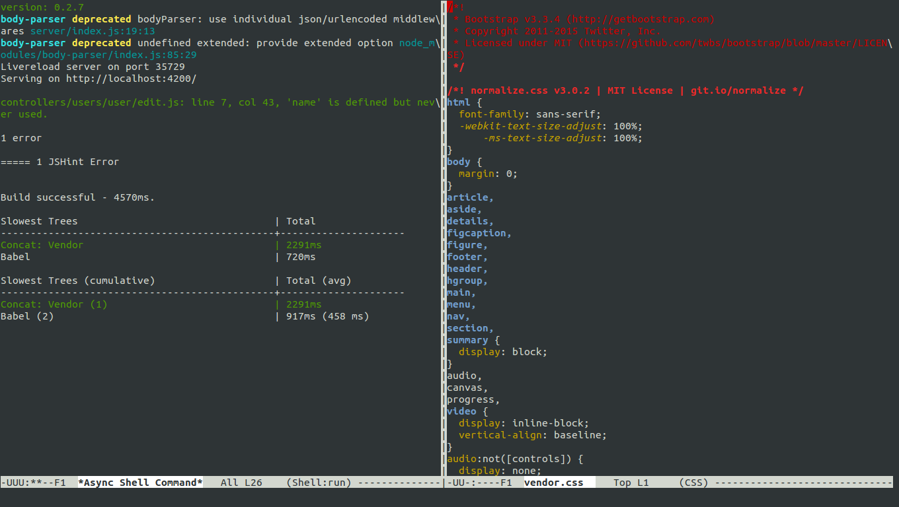

好像有什么不对劲的地方，bs3还有五个字体文件可能会用到。继续使用`app.import`导入：

```js
var bsPath = 'bower_components/bootstrap/';

app.import(bsPath + 'dist/css/bootstrap.css');

app.import(bsPath + 'fonts/glyphicons-halflings-regular.eot', {
  destDir: 'fonts'
});
app.import(bsPath + 'fonts/glyphicons-halflings-regular.svg', {
  destDir: 'fonts'
});
app.import(bsPath + 'fonts/glyphicons-halflings-regular.ttf', {
  destDir: 'fonts'
});
app.import(bsPath + 'fonts/glyphicons-halflings-regular.woff', {
  destDir: 'fonts'
});
app.import(bsPath + 'fonts/glyphicons-halflings-regular.woff2', {
  destDir: 'fonts'
});
```

打开`dist`文件夹，五个字体文件都被放在`fonts`文件夹下，任务完成。不过我知道你一定是看不下去了，那如果有100个呢，也要这么做？这时我们需要一个broccoli插件来帮助完成这个工作，使用npm安装**broccoli-funnel**：

```js
npm install broccoli-funnel --save-dev
```

将上面的代码改为：

```js
// Brocfile.js

var EmberApp = require('ember-cli/lib/broccoli/ember-app');
var Funnel = require('broccoli-funnel');

var app = new EmberApp();

var bowerPath = 'bower_components/';
var bsPath = bowerPath + 'bootstrap';

app.import(bsPath + '/dist/css/bootstrap.css');

var bsFonts = new Funnel(bsPath, {
  srcDir: '/fonts',
  include: ['**/*.*'],
  destDir: '/fonts'
});

module.exports = app.toTree(bsFonts);
```

重新启动服务，检查`dist`文件夹，发现所有的字体都导入在fonts文件夹下了。不过像这种万年不变的文件，可以直接复制到`public`文件夹里面。因为`public`文件夹下的文件会直接复制在了`dist`文件夹下，利用这个功能也可以实现刚才的效果，不过万一bs更新后还要重新复制。当然，图片就可以这么做，我们在`public`新建一个`images`文件夹：

```sh
mkdir public/images
```

自动刷新后可以看到`images`文件夹被复制在`dist`下。

## 添加菜单

所需要的文件都准备好了，接下来开始美化工作。

首先要做些清理工作，把**Welcome to Ember.js**去掉，他已经不能继续作战了。

```hbs
{{!-- app/templates/application.hbs --}}

{{outlet}}
```

把自动跳转到`/users`的钩子也去掉，也不需要了，删除`app/routes/index.js`的`beforeModel`内容：

```js
// app/routes/index.js

import Ember from 'ember';

export default Ember.Route.extend({

  beforeModel() {

  }
});
```

开始添加内容。在`app/templates/application.hbs`添加头部：

```hbs
{{!-- app/templates/application.hbs --}}

{{!-- top --}}
<nav class="navbar navbar-inverse navbar-fixed-top">
  <div class="container-fluid">
  <div class="navbar-header">
    <button type="button" class="navbar-toggle collapsed" data-toggle="collapse" data-target="#navbar" aria-expanded="false" aria-controls="navbar">
	  <span class="sr-only"></span>
	  <span class="icon-bar"></span>
	  <span class="icon-bar"></span>
	  <span class="icon-bar"></span>
	</button>
	{{#link-to 'index' class="navbar-brand"}}
	  <b class="text-uppercase">{{Aaa.name}}</b> - <span class="small">版本号: {{Aaa.version}}</span>
	{{/link-to}}
	</div>
  </div>
</nav>
```

固定在头部的导航栏需要给`body`加`padding`，修改样式表：

```css
/*app/styles/app.css*/

.body {
  padding-top: 50px;
}

.navbar-fixed-top {
  border: 0;
}
```

接着添加侧边栏和菜单：

```hbs
{{!-- app/templates/application.hbs --}}

{{!-- top --}}
{{!-- 以上省略 --}}

{{!-- main --}}
<div class="container-fluid">
  <div class="row">
    {{!-- sidebar --}}
	<div class="col-sm-3 col-md-2 sidebar">
	  <ul class="nav sidebar__container">
	    <li class="active">
		  {{#link-to 'users'}}
		    <span class="glyphicon glyphicon-user"></span> 用户管理 <span class="sr-only"> </span>
		  {{/link-to}}
		</li>
	  </ul>
	</div>
	{{!-- body --}}
	<div class="col-sm-9 col-sm-offset-3 col-md-10 col-md-offset-2 main">
	{{outlet}}
	</div>
  </div>
</div>
```

然后添加一些样式：

```css
/* app/styles/app.css */

.sidebar {
  display: none;
}
@media (min-width: 768px) {
  .sidebar {
    position: fixed;
	top: 51px;
	bottom: 0;
	left: 0;
	z-index: 1000;
	display: block;
	padding: 20px;
	overflow-x: hidden;
	overflow-y: auto;
	background-color: #f5f5f5;
	border-right: 1px solid #eee;
  }
}

.sidebar__container {
  margin-right: -21px;
  margin-bottom: 20px;
  margin-left: -20px;
}
  
.sidebar__container > li > a {
  padding-right: 20px;
  padding-left: 20px;
}
  
.sidebar__container > li > .active,
.sidebar__container > li > .active:hover,
.sidebar__container > li > .active:focus {
  color: #fff !important;
  background-color: #428bca !important;
}
```

页面自动刷新后，立刻就高大上了：

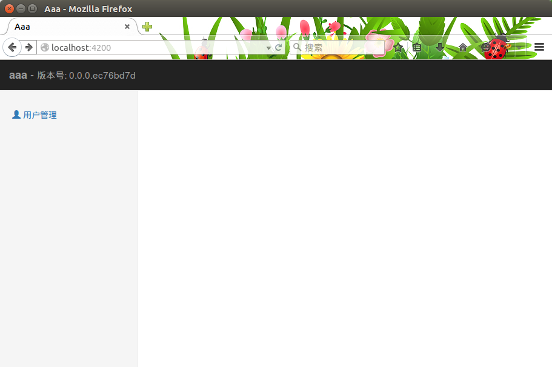

点击链接访问`/users`试试：

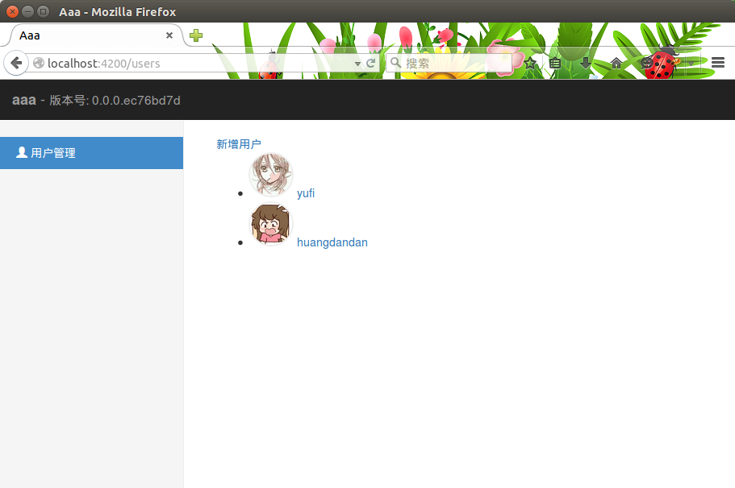

菜单变蓝，ember会为导航自动加上`active`样式。

## 修改用户管理模板

接下来为用户列表模板添加标题和表格样式。打开用户列表模板`app/templates/users/index.hbs`：

```hbs
{{!-- app/templates/users/index.hbs --}}

<h1 class="page-header">用户列表</h1>

<div class="row section">
  <div class="col-xs-12">
    {{#link-to 'users.new' class="btn btn-primary"}}新增用户{{/link-to}}
  </div>
</div>

<table class="table table-striped table-condensed">
  <thead>
    <tr>
	  <th>头像</th>
	  <th>姓名</th>
	</tr>
  </thead>
  <tbody>
    {{#each model as |user|}}
	<tr>
	  <td><span class="avatar"></span></td>
	  <td>{{#link-to 'users.user.index' user}}{{user.name}}{{/link-to}}</td>
	</tr>
	{{/each}}
  </tbody>
</table>
```

用bs3改造之后果然好看多了：

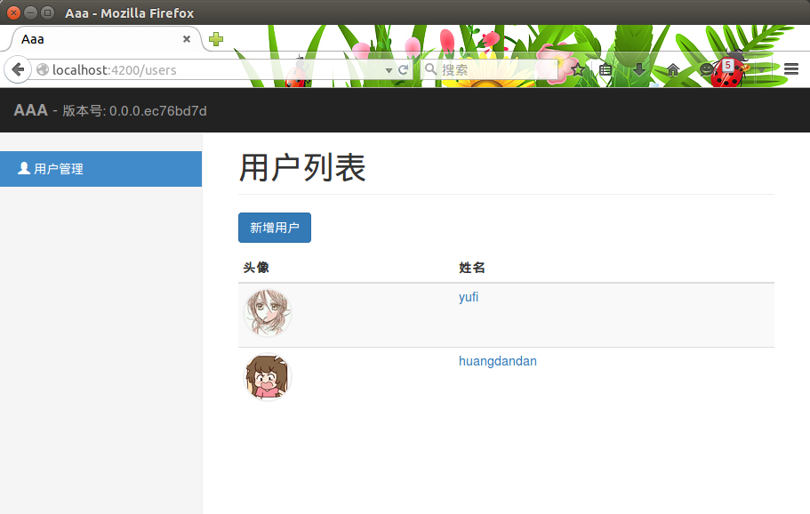

不过页面有些空，趁现在我们再多添加几个功能好了。

## 批量删除

批量删除的逻辑很简单，表格前边有复选框，选择后点击批量删除按钮删除选中的用户。需要做的功能：

* 全选
* 显示选择数量

惯例先来修改模板：

```hbs
{{!-- app/templates/users/index.hbs --}}

{{!-- 添加批量删除按钮 --}}
<div class="row section">
  <div class="col-xs-12">
    {{#link-to 'users.new' class="btn btn-primary"}}新增用户{{/link-to}}
	<button type="button" class="btn btn-danger" {{action "doDelete"}}>
	  批量删除 <span class="badge">{{checkedUsersLength}}</span>
	</button>
  </div>
</div>

{{!-- 添加复选框 --}}
<thead>
  <tr>
    <th>{{input type="checkbox" checked=isChecked}}</th>
	<th>头像</th>
	<th>姓名</th>
  </tr>
</thead>

<tbody>
  {{#each model as |user|}}
  <tr>
    <td>{{input type="checkbox" checked=user.isChecked}}</td>
	<td><span class="avatar"></span></td>
	<td>{{#link-to 'users.user.index' user}}{{user.name}}{{/link-to}}</td>
  </tr>
  {{/each}}
</tbody>
```

修改控制器，添加一个**itemController*，并且给实体添加isChecked属性，貌似之前新建过一个控制器，是`app/controllers/users/user/index.js`，这里直接用他好了：

```js
// app/controllers/users/index.js

// item控制器
itemController: 'users.user.index',

// 全选按钮
isChecked: Ember.computed('model.@each.isChecked', function(key, value) {

  let users = this.get('model');

  if(value === undefined) {
    if(!users.get('length')) { return false; }
	return users.everyBy('isChecked');
  } else {
    users.forEach(function(user) {
	  user.set('isChecked', value);
	});
	
	return value;
  }
}),

// 计算被选择的用户数量
checkedUsersLength: Ember.computed('model.@each.isChecked', function() {
  return this.get('model').filterBy('isChecked').length;
}),

// 添加批量删除action
actions: {
  doDelete() {

    let users = this.get('model').filterBy('isChecked');

    Ember.RSVP.allSettled(users.map(function(user) {
	  return user.destroyRecord();
	})).then(function() {
	  this.set('isChecked', false);
	}.bind(this));
  }
}
```

修改item控制器，添加一个**isChecked**属性：

```js
// app/controllers/users/user/index.js

isChecked: Ember.computed('model', function() {
  this.set('model.isChecked', false);
  return false;
})
```

完成之后检查功能，全选和批量删除都可以正常使用：

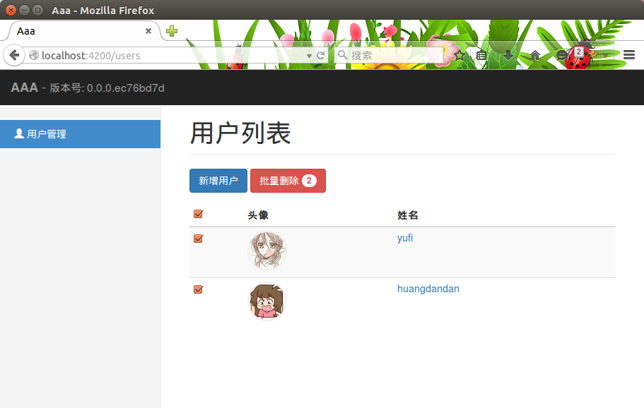

## 列表筛选

一般列表都有一个搜索栏，用于各种条件搜索。就来做一个最简单的姓名搜索吧。需要做的功能只有一个，筛选角色姓名符合的用户。

还是先来修改模板：

```hbs
{{!-- app/templates/users/index.hbs --}}

{{!-- 添加搜索栏 --}}
<div class="row section">
  <div class="col-xs-12">
    <div class="input-group input-group-lg">
	  <span class="input-group-addon">GO!</span>
	  {{input type="search" value=searchValue class="form-control" placeholder="用户姓名"}}
	</div>
  </div>
</div>

{{!-- 添加空列表模板 --}}
{{#if matchedUsers.length}}
  <table>
  {{!-- table省略，将model修改为matchedUsers --}}
    {{#each matchedUsers as |user|}}
  {{!-- table省略 --}}
  </tabel>
{else}}
  <div class="alert alert-info">暂无数据</div>
{{/if}}
```

在控制器里添加筛选功能：

```js
// app/controllers/users/index.js

// 匹配条件的列表
matchedUsers: Ember.computed(function() {
  return this.get('model');
}),

// 监视搜索框输入
searchValueDidChange: Ember.observer('searchValue', function() {

  let searchValue = this.get('searchValue');
  let users = this.get('model');

  return this.set('matchedUsers', users.filter(function(user) {
    return new RegExp('^' + searchValue).test(user.get('name'));
  }));
}),
```

这时注意要把全选里面用到**model**的地方，全部要换成**matchedUsers**，这样全选的数量才能显示正确。

让我们看看劳动成果：

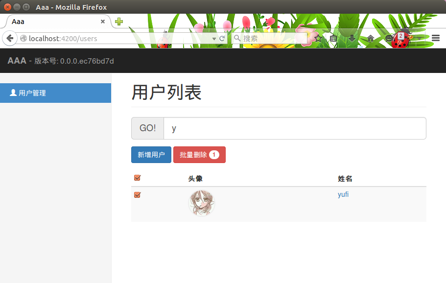

## 修改用户详情和编辑页面

接下来的工作就轻松多了，只还剩下用户详情和编辑页面。

性别和年龄我觉得可以放在一起显示，另外用用户详情可以用姓名做标题。一步步来，首先创建一个组件用来显示性别和年龄：

```sh
ember g component sex-age
```

接下来修改组件模板：

```hbs
{{!-- app/templates/components/sex-age.hbs --}}

<b>
<span style="font-size: 2em;">{{sexFmt}}</span>
<span>{{age}}</span>
</b>
```

紧跟着修改组件，用颜色区分性别，蓝色表示汉子，红色表示汉子：

```js
// app/components/sex-age.js

import Ember from 'ember';

export default Ember.Component.extend({

  tagName: 'p',

  classNameBindings: ['sex:text-primary:text-danger'],

  sexFmt: Ember.computed('sex', function() {
    return this.get('sex') ? '\u2642' : '\u2640';
  })
});
```

然后修改用户详情模板，加上刚才的组件：

```hbs
{{!-- app/templates/users/user/index.hbs --}}

<div class="row section">
  <div class="col-xs-12">
    {{#link-to 'users' class="btn btn-info"}}返回{{/link-to}}
  </div>
</div>

{{#with model as |user|}}

<h1 class="page-header">{{user.name}}</h1>

<div class="row section">
  <div class="col-xs-12">
    {{#link-to 'users.user.edit' class="btn btn-primary"}}修改资料{{/link-to}}
	<button type="button" {{action 'doDelete' user.id}} class="btn btn-danger">
	  删除用户
	</button>
  </div>
</div>

<div class="row">
  <div class="col-xs-12 col-sm-2 text-center">
    <span class="avatar">
	  
	</span>
  </div>
  <div class="col-xs-12 col-sm-10">
    {{sex-age sex=user.sex age=user.age}}
  </div>
</div>
{{/with}}
```

然后修改编辑页面的组件模板，`app/templates/components/user-detail.hbs`：

```hbs
{{!-- app/templates/components/user-detail.hbs --}}

<div class="row section">
  <div class="col-xs-12">
    {{#link-to 'users' class="btn btn-info"}}返回{{/link-to}}
  </div>
</div>

<h1 class="page-header">设置信息</h1>

<div class="row">
  <div class="col-xs-12 col-md-8 col-md-offset-2">
    <form class="form-horizontal" {{action "doSave" on="submit"}}>
	  <div class="form-group">
	    <label for="avatar" class="col-xs-2 control-label">头像</label>
		<div class="col-xs-10">
		  {{input name="avatar" id="avatar" value=user.avatar class="form-control"}}
		</div>
	  </div>
		
	  <div class="form-group">
	    <label for="name" class="col-xs-2 control-label">姓名</label>
		<div class="col-xs-10">
		  {{input name="name" id="name" value=user.name class="form-control"}}
		</div>
	  </div>
		
	  <div class="form-group">
	    <label for="age" class="col-xs-2 control-label">年龄</label>
		<div class="col-xs-10">
		  {{input name="age" id="age" type="number" value=user.age class="form-control"}}
		</div>
	  </div>
	  
	  <div class="form-group">
	    <label for="sexM" class="col-xs-2 control-label">性别</label>
		<div class="col-xs-10">
		  <label for="sexM" class="radio-inline">
		    <input name="sex" id="sexM" type="radio" checked={{user.sex}} {{action "toggleSex" on="change"}} /> 男
		  </label>

          <label for="sexF" class="radio-inline">
		    <input name="sex" id="sexF" type="radio" checked={{sexInverseValue}} {{action "toggleSex" on="change"}} /> 女
		  </label>
		</div>
	  </div>
	  <div class="form-group">
	    <div class="col-xs-10 col-xs-offset-2">
		  <button type="submit" class="btn btn-primary">保存信息</button>
		</div>
	  </div>
	</form>
  </div>
</div>
```

修改效果如下：

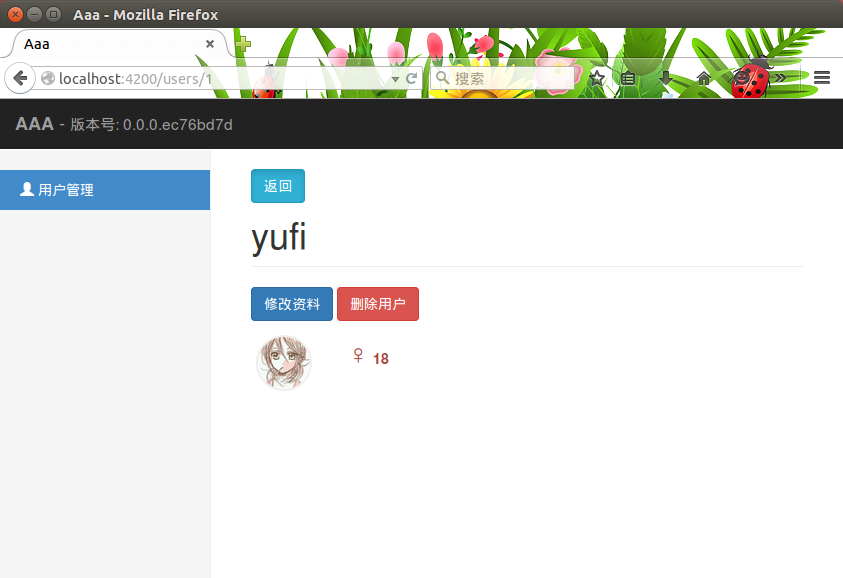

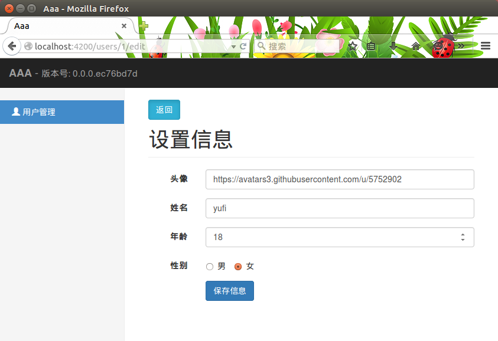

## 添加首页

关掉服务重启并打开`localhost:4200`，来欣赏一下我们的成果。貌似哪里还不太对，首页右边什么都没有。不行！现在就来给他添加内容。

那具体要添加些什么呢？为了糊弄观众老爷们，我决定弄一个大些的欢迎框，然后把用户信息简单统计到首页来。

根据上边的说明，首页是一个视图容器，包括两个子视图，可能还需要一个控制器和一个饼图。利用ember-cli快速生成：

```sh
ember g controller index

ember g view index

ember g view index/welcome

ember g view index/users

ember g template index/welcome

ember g template index/users

ember g component chart-pie
```

好吧……有点略多。先来处理视图容器：

```js
// app/views/index/welcome.js

import Ember from 'ember';

export default Ember.View.extend({
  templateName: 'index/welcome'
});
```

用户管理同理：

```js
// app/views/index/users.js

import Ember from 'ember';

export default Ember.View.extend({
  templateName: 'index/users'
});
```

接下来修改首页视图：

```js
// app/views/index.js

import Ember from 'ember';
import welcomeView from './index/welcome';
import usersView from './index/users';

export default Ember.ContainerView.extend({
  childViews: [welcomeView, usersView],
});
```

这样设置就没问题了。然后在模板里添加内容，先来最简单的巨型框：

```hbs
{{!-- app/templates/index/welcome.hbs --}}

<div class="jumbotron">
  <h1>AAA</h1>
  <p>aaa初级进化版</p>
</div>
```

接下来添加用户管理统计模板：

```hbs
{{!-- app/templates/index/users.hbs --}}

<div class="row">
  <div class="col-xs-4">
    <div class="panel panel-default">
	  <div class="panel-body">
	    <h2>用户管理</h2>
		<p>总人数: {{usersNumber}}人</p>
	  </div>
	  {{#if usersNumber}}
	  <div class="text-center">
	  {{chart-pie data=usersData}}
	  </div>
	  {{/if}}
	</div>
  </div>
</div>
```

这里需要用到总人数和男女数量，获取数据要用到model钩子，需要做的就是修改路由。打开`app/routes/index.js`，看到之前的beforeModel钩子还躺在那里，在下面接着添加model钩子。因为首页可能还会有其他统计信息，看样子这里需要用到**RSVP.hash**：

```js
// app/routes/index.js

model() {
  return Ember.RSVP.hash({
    users: this.store.find('user')
  });
}
```

在控制器里边添加统计信息，打开`app/controllers/index.js`：

```js
// app/controllers/index.js

import Ember from 'ember';

export default Ember.Controller.extend({

  // 用户总量
  usersNumber: Ember.computed('model.users', function() {
    return this.get('model.users').get('length');
  }),

  // 饼图要用到的男女数量和颜色
  usersData: Ember.computed('model.users', function() {
    return [{
	  value: this.get('model.users').filterBy('sex').length,
	  color: '#337ab7'
	},{ 
	  value: this.get('model.users').filterBy('sex', false).length,
	  color: '#a94442'
	}];
  })
});
```

接下来就是饼图了，我们来使用一个简单的，那就是[Chart.js](https://github.com/nnnick/Chart.js)。使用bower安装他：

```sh
bower install --save Chart.js
```

然后修改`Brocfile.js`，把他请到项目来：

```js
app.import(bowerPath + 'Chart.js/Chart.min.js');
```

之后重启项目。继续回来，修改饼图组件`chart-pie`：

```hbs
{{!-- app/templates/components/chart-pie.hbs --}}

canvas class="chart" width="260" height="260"></canvas>
```

在dom准备完成后需要初始化饼图：

```js
// app/components/chart-pie.js

import Ember from 'ember';

export default Ember.Component.extend({
  didInsertElement: function() {

    let ctx = this.$().find('.chart')[0].getContext('2d');

    return new Chart(ctx).Pie(this.get('data'));
  }
});
```

修改完成，看看我们的首页现在的样子：

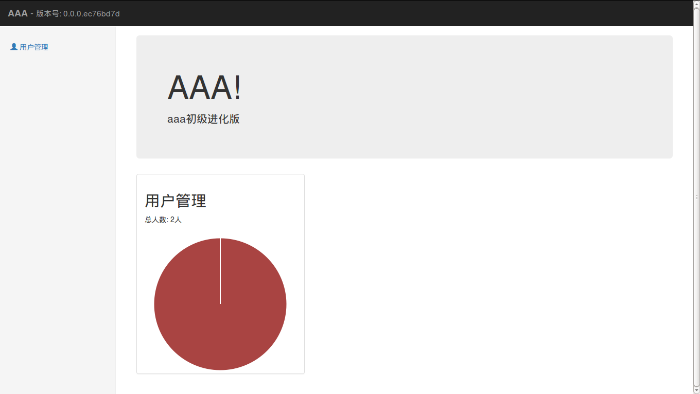

添加一个用户试试： 

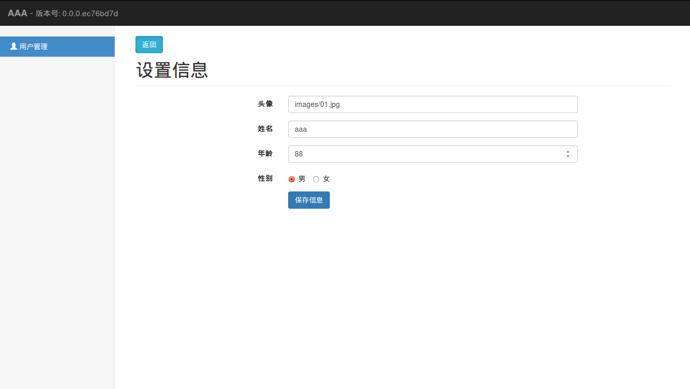

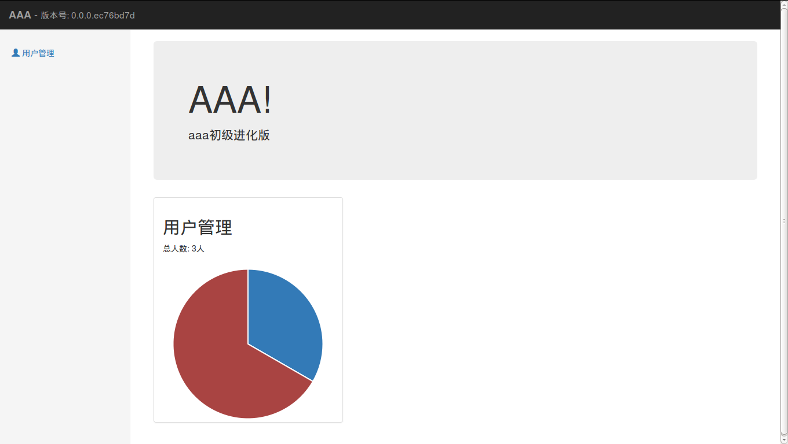

## Summary

功能完成，总之看上去比之前好多了。下一节我们来添加ember-cli插件，顺便把数据持久化到localstorage。